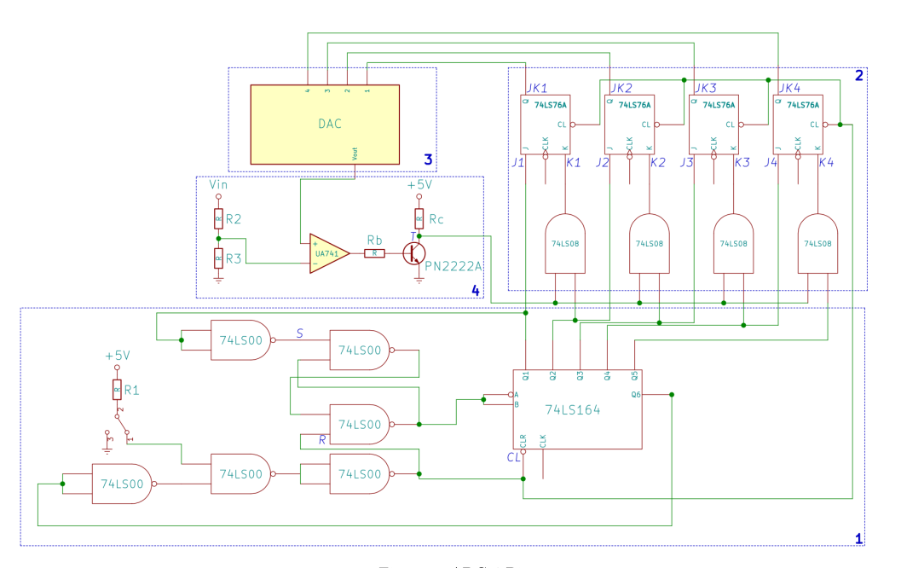

IMPLEMENTATION, TESTING AND ANALYSIS OF A 4-BIT ANALOG TO DIGITAL CONVERTER
================================================================================
Build a 4-bit ADC (Analog to Digital Converter) using integrated circuits mounted on breadboards and study some of it's physical and electrical properties such as:
- calibration;
- voltage drops;
- timings.

The goal of the project was twofold:
- validate and test the ICs' behaviour;
- use very simple statistical tools to evaluate if the empirical data is within the ranges claimed by the makers of the chips in their datasheets.

There are four main sections in this paper:
1. circuit design: schematics and specification	of the expected behavior using a digital timing diagram;
2. building, testing and analysis of the empirical data;
3. conclusions and remarks on the strengths and limitations of the project as a whole.

Here you can find an implementation of this circuit using a simple java analog circuit simulator: https://github.com/paulbutuc/4-bit-adc-simulation.

## Setup

## Goals
ADCs are one of the main building blocks in digital electronics, they bridge the gap between the analog and digital domains, so learning how they work can prove beneficial in many fields.

Circuit design and development is a multidisciplinary field so this project could be of interest for physicists, engineers and computer scientists. Some ways in which this project may be useful:
- use it to simply follow along and build your own tested and documented ADC;
- get a glimpse of the kind of work a physicist does when developing circuits in the lab;
- dive deep into the mechanics and workings of the circuit and it's physical properties.

## Acknowledgements
This project was developed for the third-year course [`Laboratorio di elettronica`](https://fisica.campusnet.unito.it/do/storicocorsi.pl/Show?_id=d7bd_1819) at Unito's department of physics. The rights of the circuit itself go to Unito.

I thank Stefano Giannini for helping with building and testing the circuit and with writing some smaller parts of the paper.

The latex template used to generate the PDF document was created from scratch by me.

## Disclaimer
The author/associates/owner of this project cannot be held responsible for any damages in the form of physical loss/monetary loss or any kind of loss that comes as the result of the presented project.

The projects is only for educational purpose and should not be replicated or modified for the sake of hurting any human (including self-hurting)/animals/private or public property.

The person/group of people must take enough precautions before replicating any project/ideas presented in this project, such as wearing rubber shoes and electrical gloves while working with high voltage projects, wearing eye goggles and allowing fresh air while soldering the projects etc to say a few.

Beginners and inexperienced individuals in electronics/electrical industry should NOT make any high voltage / AC mains projects.

The readers who agree to this disclaimer may follow the information/ideas/make projects, readers who disagree may not follow any information or make any projects presented in this repository.
